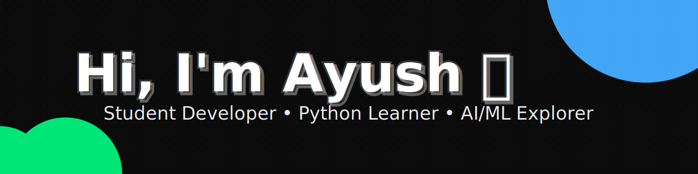

<!--
This is your GitHub Profile README.
To activate it on your profile, create a public repository named exactly "ayush3739" and place this README.md at the root.
-->

  
   

## About me

- 🎓 Student actively learning Python and exploring AI/ML.
- 🧠 Building foundations with core Python and beginner ML libraries.
- 🧪 I learn by doing—100 Days of Python projects, games, and automation.
- 🏁 Hackathons: Participated in 2–3 hackathons.
- 🏅 Certifications: See below.
- 🌱 Not an open-source contributor yet, but excited to start soon.

- 💼 Role: Student Developer
- 📍 Location: Greater Noida (IST)
- ✉️ Contact: ayushmaurya21086@gmail.com

---

## 🔧 Toolbox

<!-- Python libraries you're learning -->

---

## 📂 Featured Project Repositories

### 🐍 [Python-100-days](https://github.com/ayush3739/Python-100-days)
> 100 Days of Python — Angela Yu's course projects showcase

**Key Projects Inside:**
- 🎮 **Snake Game** — Classic snake with Turtle graphics, movement + collision logic
  - [View Code →](https://github.com/ayush3739/Python-100-days/tree/main/PROJECTS/Snake%20game)
- 🏓 **Pong Game** — Two‑player paddle game built with OOP and Turtle
  - [View Code →](https://github.com/ayush3739/Python-100-days/tree/main/PROJECTS/Pong%20game)
- 🔐 **Password Manager** — Tkinter GUI app to generate and securely store passwords
  - [View Code →](https://github.com/ayush3739/Python-100-days/tree/main/PROJECTS/Password%20Manager)
- 📊 **Habit Tracker** — Track habits using Pixela API (HTTP requests, auth, JSON)
  - [View Code →](https://github.com/ayush3739/Python-100-days/tree/main/PROJECTS/Habit%20Tracker)
- 💪 **Exercise Tracker** — Log workouts with natural language → Google Sheets API
  - [View Code →](https://github.com/ayush3739/Python-100-days/tree/main/PROJECTS/Exercise%20Tracker)
- 📈 **Stock News Messenger** — Monitor stocks & send SMS alerts with news
  - [View Code →](https://github.com/ayush3739/Python-100-days/tree/main/PROJECTS/Stock%20News%20Messenger)

**Technologies:** Python, Tkinter, APIs (REST), OOP, Turtle Graphics

---

### 💼 [CODSOFT](https://github.com/ayush3739/CODSOFT)
> Internship projects for CodSoft — GUI applications & utilities

**Projects Inside:**
1. **Password Generator** — Generates strong passwords based on user input
2. **Rock, Paper, Scissors Game (GUI)** — Interactive game with random choice logic
3. **To-Do List App (GUI)** — Task management with add, delete, mark-done using Tkinter
4. **Calculator App (GUI)** — Basic arithmetic calculator with clean interface

**Technologies:** Python, Tkinter, Random module

[📖 View Repository →](https://github.com/ayush3739/CODSOFT)

---

### 🌍 [Urban-Planner](https://github.com/ayush3739/Urban-Planner)
> AI-powered safety navigation app — Zero to One Hackathon project by Team FutureFrame

**Description:**  
Routes scoring system based on real-time safety data using NASA Earthdata API for urban heat islands and water stress analysis.

**Key Features:**
- 🔥 Urban Heat Island detection using MODIS satellite data
- 💧 Water stress monitoring with GRACE data
- 🗺️ Safety-first route recommendations
- 🎨 Modern UI with Next.js and TypeScript

**Technologies:** TypeScript, Next.js, React, NASA Earthdata API, CMR Search

[🚀 View Repository →](https://github.com/ayush3739/Urban-Planner)

---

### 🎯 [Projects](https://github.com/ayush3739/Projects)
> Collection of 20+ web applications, automation tools, and Python projects

**Featured Projects Inside:**

- ✍️ **Blog Website** — Full-featured Flask blog with user authentication, admin controls, rich text editor (CKEditor), comments system, Gravatar avatars, and SMTP email contact form
  - **Tech:** Flask, SQLAlchemy, Flask-Login, Bootstrap 5, SQLite
  - [View Code →](https://github.com/ayush3739/Projects/tree/main/Blog%20Website)

- ✈️ **Flight Deals Finder** — Automated flight price monitoring system with multi-destination tracking and instant WhatsApp/Email notifications
  - **Tech:** Python, Amadeus API, Sheety API, Twilio, SMTP
  - [View Code →](https://github.com/ayush3739/Projects/tree/main/Flight%20Deals)

- ☕ **Coffee and Wifi Cafe Tracker** — Flask web app for tracking and rating cafes based on wifi, power outlets, and coffee quality
  - **Tech:** Flask, WTForms, Bootstrap, CSV
  - [View Code →](https://github.com/ayush3739/Projects/tree/main/Coffee%20and%20Wifi%20Cafe%20Tracker)

- 💪 **Exercise Tracker** — Natural language exercise logging with automatic calorie calculation using Nutritionix API
  - **Tech:** Python, Nutritionix API, Google Sheets API
  - [View Code →](https://github.com/ayush3739/Projects/tree/main/Exercise%20Tracker)

- 🎬 **100 Movies Scraper** — Web scraping project to extract top 100 movies list using BeautifulSoup
  - **Tech:** Python, BeautifulSoup, requests
  - [View Code →](https://github.com/ayush3739/Projects/tree/main/100%20movies%20to%20watch%20start)

- 🎵 **Spotify Billboard Playlist** — Create Spotify playlists from Billboard Hot 100 charts
  - **Tech:** BeautifulSoup, Spotify API
  - [View Code →](https://github.com/ayush3739/Projects/tree/main/Spotify%20Billboard%20Playlist)

**Other Notable Projects:**
- 🤖 Instagram Follower Bot (Selenium automation)
- 🍪 Cookie Clicker Bot (Game automation)
- 🏋️ Gym Booking Bot (Automated slot booking)
- 🌧️ Rain Alert (Weather-based notifications)
- 📧 Birthday Wish Sender (Automated SMTP emails)
- 🐍 Snake Game, Pong Game, Turtle Crossing (Turtle graphics games)
- 🔐 Password Manager (Tkinter GUI with JSON storage)
- ⏱️ Pomodoro Timer (Productivity tool)

**Technologies:** Flask, SQLAlchemy, BeautifulSoup, Selenium, Tkinter, APIs (REST), Web Scraping, Automation

[📂 View Repository →](https://github.com/ayush3739/Projects)

---

### 🔧 Other Repositories

- **[Java-workshop](https://github.com/ayush3739/Java-workshop)** — Java fundamentals with multithreading, synchronization & file I/O
- **[Deploy_repo](https://github.com/ayush3739/Deploy_repo)** — TinDog project with Bootstrap components
- **[coding-resources](https://github.com/ayush3739/coding-resources)** — Curated learning resources for web development

---

## 📈 DSA Progress

[LeetCode Profile →](https://leetcode.com/u/Ayush_M370/)

---

## 🏅 Certifications

- [AI Certification](https://lnkd.in/gKrEGTWk) — Devtown (2025‑07) — Demonstrates understanding of AI concepts and real‑world applications.
- Generative AI Mastery Workshop — NxtWave (2025‑07) — Shows hands‑on application of Generative AI in problem‑solving.
- Student Internship Program (CIP) — CodSoft (2025‑07) — Validates practical Python and GUI development skills through multiple projects.
- Google Cloud Arcade Facilitator Program 2025 — Google (2025‑05) — Highlights experience with cloud technologies in a collaborative learning environment.
- Programming Fundamentals Using Python — Infosys (2024‑09) — Confirms foundational skills in Python programming from a reputable tech company.

---

## 🚀 Hackathons & Competitive Events

- **Zero to One Hackathon – Campus Tank** — Chandigarh University (2025)  
  🏆 Project: [Urban-Planner](https://github.com/ayush3739/Urban-Planner) — AI‑powered safety navigation app using NASA Earthdata API  
  👥 Team: FutureFrame  
  Links: [Recent activity](https://www.linkedin.com/in/ayush-maurya-b39914315/recent-activity/all/)
  
- **"Level Up" Event** — Reboot Club, NIET Greater Noida (2025)  
  🥉 Outcome: Secured 3rd Prize with a team of five.
  
- **Code‑A‑Thon 2.0** — Noida Institute of Engineering & Technology (2025)  
  Role: Participant — Solved coding challenges in a competitive setting.

---

## ✨ Fun Facts

- I believe the safest route matters more than the fastest.
- I enjoy learning through gamified challenges that push me to think differently.
- Consistently sharpening my problem‑solving skills on LeetCode.

---

## 📊 GitHub Stats

 

---

## 🤝 Let's connect

- 💼 LinkedIn: [Ayush Maurya](https://www.linkedin.com/in/ayush-maurya-b39914315/)
- 💌 Email: ayushmaurya21086@gmail.com
- 🧩 LeetCode: [Ayush_M370](https://leetcode.com/u/Ayush_M370/)

---

## 📝 Now

- 🔸 Learning: Python core + AI/ML libraries (NumPy, pandas, scikit‑learn)
- 🔸 Building: Mini projects from 100 Days of Python
- 🔸 Next up: Explore TensorFlow/PyTorch and simple ML projects

  
Made with ❤️ by Ayush

