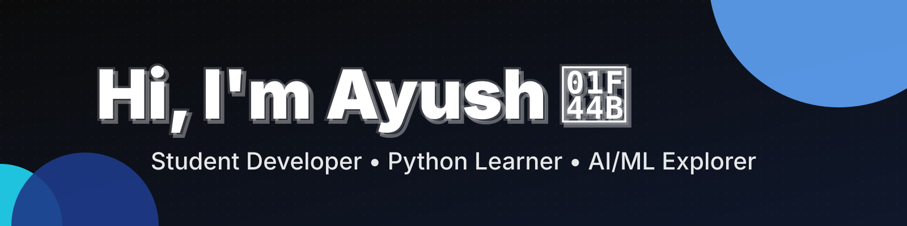

<!--
This is your GitHub Profile README.
To activate it on your profile, create a public repository named exactly "ayush3739" and place this README.md at the root.
-->

<div align="center">
  
  <br/>
</div>

<div align="center">

[](https://github.com/ayush3739)
[](https://github.com/ayush3739?tab=followers)
[](https://github.com/ayush3739?tab=repositories&type=source)
[](https://leetcode.com/u/Ayush_M370/)

</div>

## 👨‍💻 About Me

> **Student Developer** passionate about AI/ML, LLM Engineering, and Full-Stack Web Development.

| | |
|---|---|
| 💼 **Role** | Student Developer |
| 📍 **Location** | Greater Noida, India (IST) |
| 🎓 **Focus** | AI/ML · LLM Engineering · Full-Stack Web Dev |
| ✉️ **Contact** | ayushmaurya21086@gmail.com |
| 🔗 **LinkedIn** | [Ayush Maurya](https://www.linkedin.com/in/ayush-maurya-b39914315/) |
| 🧩 **LeetCode** | [Ayush_M370](https://leetcode.com/u/Ayush_M370/) |

- 🎓 B.Tech student with a strong foundation in Python, C, C++, Java, and web technologies.
- 🧠 Deep-diving into LLMs, AI Agents, RAG systems, LangGraph, and advanced Python internals.
- 🛠️ I learn by doing — completed 100 Days of Python, hands-on AI learning roadmap, and multiple deployment projects.
- 🏁 Competed in 3 hackathons, winning 3rd prize at the "Level Up" event.
- 🚀 Deployed projects across Vercel, Railway, Render, PythonAnywhere & Netlify.
- 🌱 Actively building full-stack AI-powered applications and looking to contribute to open-source.

---

## 🛠️ Tech Stack & Toolbox

**Languages**


**AI / ML / LLM Stack**


**Backend & Databases**


**Frontend & UI**


**Tools & Workflow**


**☁️ Deployment Platforms**


---

## ⭐ Production-Ready Projects

> Projects that are fully functional, deployed, and showcase real-world skills — suitable for a developer resume.

| # | Project | Tech Stack | Highlights | Live / Repo |
|---|---------|-----------|------------|-------------|
| 1 | 🤖 **AI Agent Pipeline** | Python, LangChain, LangGraph, FastAPI, mem0ai | Multi-agent system with memory, tool-calling & RAG; deployed end-to-end | [Repo](https://github.com/ayush3739/Learning-AI) |
| 2 | 📚 **RAG-QA** | Python, LangChain, Qdrant, Streamlit, OpenAI, GitHub Models | Upload any PDF → index → chat; streamed answers with page refs & hallucination guard | [Repo](https://github.com/ayush3739/RAG-QA) |
| 3 | ✍️ **Blog Website** | Flask, SQLAlchemy, Flask-Login, Bootstrap 5, SQLite | Full-featured blog — auth, admin panel, CKEditor, comments, SMTP contact | [Repo](https://github.com/ayush3739/Projects/tree/main/Blog%20Website) |
| 4 | 🌍 **Urban Planner** (Hackathon) | TypeScript, NASA Earthdata API, CMR Search | Safety-first route scoring using satellite data; Zero to One Hackathon | [Repo](https://github.com/ayush3739/Urban-Planner) |
| 5 | ✈️ **Flight Deals Finder** | Python, Amadeus API, Sheety API, Twilio, SMTP | Automated multi-city flight monitoring with WhatsApp & email alerts | [Repo](https://github.com/ayush3739/Projects/tree/main/Flight%20Deals) |
| 6 | ☕ **Cafe & Wifi Tracker** | Flask, WTForms, Bootstrap, SQLite | Full CRUD web app for rating cafes — deployed on PythonAnywhere | [Repo](https://github.com/ayush3739/Projects/tree/main/Coffee%20and%20Wifi%20Cafe%20Tracker) |
| 7 | 💪 **Exercise Tracker** | Python, Nutritionix API, Google Sheets API | Natural language workout logging with automatic calorie calculation | [Repo](https://github.com/ayush3739/Projects/tree/main/Exercise%20Tracker) |
| 8 | 🎵 **Spotify Billboard Playlist** | Python, BeautifulSoup, Spotify API | Scrapes Billboard Hot 100 and auto-creates Spotify playlists | [Repo](https://github.com/ayush3739/Projects/tree/main/Spotify%20Billboard%20Playlist) |

---

## 📂 Featured Project Repositories

### 🤖 [Learning-AI](https://github.com/ayush3739/Learning-AI)
> Comprehensive AI/ML & LLM engineering learning roadmap — 28 sections covering everything from Python internals to production AI Agents

**Sections Covered:**
- 🐍 **Sections 1–6** — Advanced Python: functions, OOP, closures, decorators, args/kwargs
- ⚙️ **Sections 7–10** — Python internals: data structures, generators, comprehensions
- 🔀 **Section 11** — Multiprocessing, Multithreading & GIL
- ⚡ **Section 12** — Asyncio & async programming
- 📐 **Section 13** — Pydantic for data validation
- 🧠 **Sections 14–15** — LLM Intro: working with OpenAI, Groq, Google GenAI APIs
- 💬 **Sections 16–17** — Prompting Techniques (Zero-shot, Few-shot, Chain-of-Thought)
- 🤗 **Sections 18–19** — Hugging Face Transformers & Ollama with Docker
- 🤖 **Section 20** — AI Agents (Tool calling, ReAct pattern)
- 📚 **Section 21** — RAG Systems (Retrieval-Augmented Generation)
- 🔁 **Section 22** — RAG with Queue systems
- 🕸️ **Sections 23–24** — LangGraph & Multimodal AI
- 🧩 **Sections 25–26** — Memory Layer in AI Agents (mem0ai)
- 🗂️ **Section 27** — Graph Memory & Knowledge Graphs
- 🎙️ **Section 28** — Voice Agents & MCP (Model Context Protocol)

**Technologies:** LangChain, LangGraph, OpenAI, Groq, Google GenAI, Hugging Face, Transformers, PyTorch, FastAPI, Pydantic, MongoDB, Qdrant, Redis, mem0ai, SpeechRecognition, Docker, Asyncio

[🚀 View Repository →](https://github.com/ayush3739/Learning-AI)

---

### 📚 [RAG-QA](https://github.com/ayush3739/RAG-QA)
> Upload any PDF → Index it → Chat with it. Answers are grounded purely in your document — hallucination-free.

**What it does:**
- 📄 **Upload** a PDF — saved locally, ready to index
- 🔍 **Index** — chunked with `RecursiveCharacterTextSplitter`, embedded via `text-embedding-3-large`, stored in Qdrant vector DB
- 💬 **Chat** — ask anything; get streamed, context-grounded answers with page references
- 🚫 **Hallucination guard** — if the answer isn't in the PDF, the system explicitly says so

**Key Features:**
- ⚡ Token-by-token streaming responses via Streamlit
- 📑 Multi-collection support — switch between indexed PDFs instantly
- 🐳 Qdrant vector DB running in Docker for fast similarity search
- 🔗 End-to-end LangChain pipeline: load → chunk → embed → retrieve → answer

**Technologies:** Python, LangChain, Qdrant, Streamlit, OpenAI (`text-embedding-3-large`, `gpt-4o-mini` via GitHub Models), Docker, PyPDFLoader

[📚 View Repository →](https://github.com/ayush3739/RAG-QA)

---

### 🐍 [Python-100-days](https://github.com/ayush3739/Python-100-days)
> 100 Days of Python — Angela Yu's course projects showcase

**Key Projects Inside:**
- 🎮 **Snake Game** — Classic snake with Turtle graphics, movement + collision logic
  - [View Code →](https://github.com/ayush3739/Python-100-days/tree/main/PROJECTS/Snake%20game)
- 🏓 **Pong Game** — Two‑player paddle game built with OOP and Turtle
  - [View Code →](https://github.com/ayush3739/Python-100-days/tree/main/PROJECTS/Pong%20game)
- 🔐 **Password Manager** — Tkinter GUI app to generate and securely store passwords
  - [View Code →](https://github.com/ayush3739/Python-100-days/tree/main/PROJECTS/Password%20Manager)
- 📊 **Habit Tracker** — Track habits using Pixela API (HTTP requests, auth, JSON)
  - [View Code →](https://github.com/ayush3739/Python-100-days/tree/main/PROJECTS/Habit%20Tracker)
- 💪 **Exercise Tracker** — Log workouts with natural language → Google Sheets API
  - [View Code →](https://github.com/ayush3739/Python-100-days/tree/main/PROJECTS/Exercise%20Tracker)
- 📈 **Stock News Messenger** — Monitor stocks & send SMS alerts with news
  - [View Code →](https://github.com/ayush3739/Python-100-days/tree/main/PROJECTS/Stock%20News%20Messenger)

**Technologies:** Python, Tkinter, APIs (REST), OOP, Turtle Graphics

---

### 💼 [CODSOFT](https://github.com/ayush3739/CODSOFT)
> Internship projects for CodSoft — GUI applications & utilities

**Projects Inside:**
1. **Password Generator** — Generates strong passwords based on user input
2. **Rock, Paper, Scissors Game (GUI)** — Interactive game with random choice logic
3. **To-Do List App (GUI)** — Task management with add, delete, mark-done using Tkinter
4. **Calculator App (GUI)** — Basic arithmetic calculator with clean interface

**Technologies:** Python, Tkinter, Random module

[📖 View Repository →](https://github.com/ayush3739/CODSOFT)

---

### 🌍 [Urban-Planner](https://github.com/ayush3739/Urban-Planner)
> AI-powered safety navigation app — Zero to One Hackathon project by Team FutureFrame

**Description:**  
Routes scoring system based on real-time safety data using NASA Earthdata API for urban heat islands and water stress analysis.

**Key Features:**
- 🔥 Urban Heat Island detection using MODIS satellite data
- 💧 Water stress monitoring with GRACE data
- 🗺️ Safety-first route recommendations
- 🎨 Modern UI with Next.js and TypeScript

**Technologies:** TypeScript, Next.js, React, NASA Earthdata API, CMR Search

[🚀 View Repository →](https://github.com/ayush3739/Urban-Planner)

---

### 🎯 [Projects](https://github.com/ayush3739/Projects)
> Collection of 20+ web applications, automation tools, and Python projects

**Featured Projects Inside:**

- ✍️ **Blog Website** — Full-featured Flask blog with user authentication, admin controls, rich text editor (CKEditor), comments system, Gravatar avatars, and SMTP email contact form
  - **Tech:** Flask, SQLAlchemy, Flask-Login, Bootstrap 5, SQLite
  - [View Code →](https://github.com/ayush3739/Projects/tree/main/Blog%20Website)

- ✈️ **Flight Deals Finder** — Automated flight price monitoring system with multi-destination tracking and instant WhatsApp/Email notifications
  - **Tech:** Python, Amadeus API, Sheety API, Twilio, SMTP
  - [View Code →](https://github.com/ayush3739/Projects/tree/main/Flight%20Deals)

- ☕ **Coffee and Wifi Cafe Tracker** — Flask web app for tracking and rating cafes based on wifi, power outlets, and coffee quality
  - **Tech:** Flask, WTForms, Bootstrap, CSV
  - [View Code →](https://github.com/ayush3739/Projects/tree/main/Coffee%20and%20Wifi%20Cafe%20Tracker)

- 💪 **Exercise Tracker** — Natural language exercise logging with automatic calorie calculation using Nutritionix API
  - **Tech:** Python, Nutritionix API, Google Sheets API
  - [View Code →](https://github.com/ayush3739/Projects/tree/main/Exercise%20Tracker)

- 🎬 **100 Movies Scraper** — Web scraping project to extract top 100 movies list using BeautifulSoup
  - **Tech:** Python, BeautifulSoup, requests
  - [View Code →](https://github.com/ayush3739/Projects/tree/main/100%20movies%20to%20watch%20start)

- 🎵 **Spotify Billboard Playlist** — Create Spotify playlists from Billboard Hot 100 charts
  - **Tech:** BeautifulSoup, Spotify API
  - [View Code →](https://github.com/ayush3739/Projects/tree/main/Spotify%20Billboard%20Playlist)

**Other Notable Projects:**
- 🤖 Instagram Follower Bot (Selenium automation)
- 🍪 Cookie Clicker Bot (Game automation)
- 🏋️ Gym Booking Bot (Automated slot booking)
- 🌧️ Rain Alert (Weather-based notifications)
- 📧 Birthday Wish Sender (Automated SMTP emails)
- 🐍 Snake Game, Pong Game, Turtle Crossing (Turtle graphics games)
- 🔐 Password Manager (Tkinter GUI with JSON storage)
- ⏱️ Pomodoro Timer (Productivity tool)

**Technologies:** Flask, SQLAlchemy, BeautifulSoup, Selenium, Tkinter, APIs (REST), Web Scraping, Automation

[📂 View Repository →](https://github.com/ayush3739/Projects)

---

### 🔧 Other Repositories

- **[Java-workshop](https://github.com/ayush3739/Java-workshop)** — Java fundamentals with multithreading, synchronization & file I/O
- **[Deploy_repo](https://github.com/ayush3739/Deploy_repo)** — TinDog project with Bootstrap components
- **[coding-resources](https://github.com/ayush3739/coding-resources)** — Curated learning resources for web development & cybersecurity

---

## 🎓 Education

| Degree | Institution | Duration |
|---|---|---|
| B.Tech (Computer Science) | Noida Institute of Engineering & Technology, Greater Noida | 2023 – Present |

---

## ✅ What I've Learned

A summary of core skills and knowledge I've built through courses, projects, and self-study:

### 🐍 Python & Programming Fundamentals
- Advanced Python: OOP, closures, decorators, generators, comprehensions, `*args`/`**kwargs`
- Python internals: memory model, data structures, GIL, multiprocessing & multithreading
- Async programming with `asyncio` and concurrent design patterns
- GUI development with Tkinter; automation with Selenium

### 🌐 Web Development
- **Frontend:** HTML5, CSS3, JavaScript, TypeScript, Bootstrap
- **Backend:** Flask (REST APIs, authentication, SQLAlchemy, CKEditor), FastAPI
- **Databases:** SQLite, MongoDB, Redis
- **Scraping & Automation:** BeautifulSoup, Selenium, requests
- **API Integration:** Twilio, Spotify, Amadeus, Nutritionix, Google Sheets, NASA Earthdata

### 🤖 AI / ML / LLM Engineering
- Data science stack: NumPy, pandas, Matplotlib, scikit-learn
- Deep learning: PyTorch, Hugging Face Transformers, Ollama with Docker
- LLM APIs: OpenAI, Groq, Google GenAI
- Prompting techniques: Zero-shot, Few-shot, Chain-of-Thought
- **AI Agents:** Tool calling, ReAct pattern, memory layers (mem0ai)
- **RAG Systems:** Retrieval-Augmented Generation, queue-based RAG
- **LangChain & LangGraph:** orchestration, multi-agent workflows, multimodal AI
- Knowledge Graphs & Graph Memory
- Voice Agents & Model Context Protocol (MCP)
- Data validation with Pydantic

### ☁️ Deployment & DevOps
- Containerisation with Docker
- Deployed full-stack and AI apps on **Vercel**, **Railway**, **Render**, **PythonAnywhere**, and **Netlify**
- Version control with Git & GitHub

---

## 📚 What I'm Currently Learning

| Topic | Status |
|---|---|
| 🤖 Agentic AI — multi-agent systems, tool calling, ReAct & planning loops | 🔄 In Progress |
| 🎙️ Voice Agents & MCP (Model Context Protocol) | 🔄 In Progress |
| 🕸️ LangGraph — advanced multi-agent workflows | 🔄 In Progress |
| 🧩 Memory Layer in AI Agents (mem0ai, Graph Memory) | 🔄 In Progress |
| 📊 scikit-learn — deeper ML: pipelines, ensembles, model tuning | 🔄 In Progress |
| 🏗️ Production-grade RAG system architecture | 🔄 In Progress |
| 📈 DSA on LeetCode — consistent daily practice | 🔄 In Progress |

---

## 🗺️ Future Roadmap

```
✅ Completed
├── ✅ Complete AI/ML & LLM Engineering curriculum (28 sections)
└── ✅ Deploy production-ready Flask & FastAPI applications

2025 Q2–Q3  ████████████░░░░  In Progress
├── 🔄 Build end-to-end RAG + Agent pipelines with memory & tool-calling
├── 🔄 Master LangGraph multi-agent systems
└── 🔄 Contribute to open-source AI/LLM projects

2025 Q4     ░░░░░░░░░░░░░░░░  Planned
├── 🎯 Full-stack AI SaaS product (FastAPI + LangGraph + Bootstrap)
├── 🎯 Advanced DSA — reach LeetCode Knight/Guardian badge
├── 🎯 Cloud deployment: AWS / GCP fundamentals
└── 🎯 Internship / Junior Developer role in AI/ML or Full-Stack

2026        ░░░░░░░░░░░░░░░░  Vision
├── 🎯 Open-source contributions to LangChain / HuggingFace
├── 🎯 Build and publish a PyPI package
├── 🎯 Research in AI Agents and autonomous systems
└── 🎯 Work on real-world AI products at scale
```

---

## 📈 DSA Progress

[LeetCode Profile →](https://leetcode.com/u/Ayush_M370/)

<div align="center">
<a href="https://leetcode.com/u/Ayush_M370/">
  
</a>
</div>

---

## 🏅 Certifications

- [AI Certification](https://lnkd.in/gKrEGTWk) — Devtown (2025‑07) — Demonstrates understanding of AI concepts and real‑world applications.
- Generative AI Mastery Workshop — NxtWave (2025‑07) — Shows hands‑on application of Generative AI in problem‑solving.
- Student Internship Program (CIP) — CodSoft (2025‑07) — Validates practical Python and GUI development skills through multiple projects.
- Google Cloud Arcade Facilitator Program 2025 — Google (2025‑05) — Highlights experience with cloud technologies in a collaborative learning environment.
- Programming Fundamentals Using Python — Infosys (2024‑09) — Confirms foundational skills in Python programming from a reputable tech company.

---

## 🚀 Hackathons & Competitive Events

- **Zero to One Hackathon – Campus Tank** — Chandigarh University (2025)  
  🏆 Project: [Urban-Planner](https://github.com/ayush3739/Urban-Planner) — AI‑powered safety navigation app using NASA Earthdata API  
  👥 Team: FutureFrame  
  Links: [Recent activity](https://www.linkedin.com/in/ayush-maurya-b39914315/recent-activity/all/)
  
- **"Level Up" Event** — Reboot Club, NIET Greater Noida (2025)  
  🥉 Outcome: Secured 3rd Prize with a team of five.
  
- **Code‑A‑Thon 2.0** — Noida Institute of Engineering & Technology (2025)  
  Role: Participant — Solved coding challenges in a competitive setting.

---

## ✨ Fun Facts

- I believe the safest route matters more than the fastest.
- I enjoy learning through gamified challenges that push me to think differently.
- Consistently sharpening my problem‑solving skills on LeetCode.

---

## 📊 GitHub Stats

<div align="center">

<a href="https://github.com/anuraghazra/github-readme-stats">
  
</a>
<a href="https://github.com/anuraghazra/github-readme-stats">
  
</a>
<br/>
<a href="https://git.io/streak-stats">
  
</a>
<br/>
<a href="https://github.com/Ashutosh00710/github-readme-activity-graph">
  
</a>
</div>

---

## 🤝 Let's connect

- 💼 LinkedIn: [Ayush Maurya](https://www.linkedin.com/in/ayush-maurya-b39914315/)
- 💌 Email: ayushmaurya21086@gmail.com
- 🧩 LeetCode: [Ayush_M370](https://leetcode.com/u/Ayush_M370/)

---

## 📝 Now
- 🔸 **Learning:** Agentic AI — multi-agent systems, LangGraph, Voice Agents & MCP
- 🔸 **Deepening:** scikit-learn — ML pipelines, ensembles, and model tuning
- 🔸 **Building:** End-to-end AI Agent pipelines with memory and tool-calling
- 🔸 **Next up:** Deploy production-ready RAG + Agent systems on cloud platforms

<div align="center">
  
Made with ❤️ by Ayush

</div>